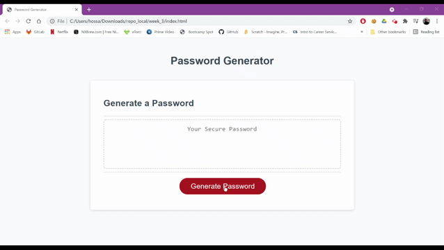

# Password-Generator  

This application generate a random and secure password between 8 to 128 characters for the user. The application emphasizes the use of Javascript to generate the password.  

# Install  
The password generator is an web app and its deployed on github.The link for the file and repository is given below. 
   

 **[Password Generator](https://thossain89.github.io/Password_Generator/)**

**[Password Generator Repository](https://github.com/thossain89/Password_Generator.git)**

The user simply need to press the "Generate Password" button on the web page to start the program.

   
The user will be given some prompt messages to find out what kind of password they want to generate.
 

 The prompt are as follows:

<ol>
    <li>Select between 8 to 128 character</li>
    <li>Option to add numbers</li>
    <li>Option to add Special Characters</li>
    <li>Option to select lowercase alphabet</li>
    <li>Option to select uppercase alphabet</li>
</ol>
 

## Demo Of the Password Generator  

## Author 

### Tanvir Hossain

&copy; 2021 Tanvir Hossain, Coding Bootcamp ,University of Sydney and Trilogy Education

